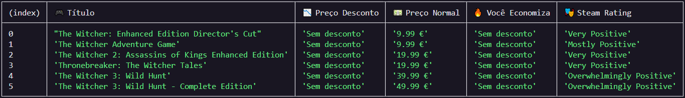

# Pesquisa de Promoções de Jogos - CLI

Este é um projeto em Node.js que permite pesquisar jogos em promoção através da API CheapShark diretamente a partir da linha de comandos.

## Seleção da API
A API escolhida para este projeto é a [CheapShark API](https://www.cheapshark.com/api/), que fornece informações sobre jogos em promoção em diversas lojas digitais. A escolha desta API foi baseada nos seguintes motivos:

- Não requer autenticação.
- Permite obter informações detalhadas sobre preços e descontos de jogos.
- É útil para gamers que procuram as melhores ofertas.

## Funcionalidade CLI
Este programa permite pesquisar um jogo pelo nome e exibir uma lista dos resultados com informações como preço original, preço com desconto, economia percentual e avaliação na Steam.

### Comandos Disponíveis
```
Uso: node main.js [opções]

Opções disponíveis:
  [título]            → Pesquisa o nome do jogo
  [título] --sort     → Pesquisa o nome do jogo e ordena pelo menor preço
  --help              → Exibe esta mensagem de ajuda
```

## Instalação e Configuração
1. Certifique-se de ter o [Node.js](https://nodejs.org/) instalado.
2. Clone este repositório:
   ```sh
   git clone https://github.com/Tomas4030/programming-ii.git
   ```
3. Instale as dependências necessárias:
   ```sh
   npm install
   ```
4. Execute o programa:
   ```sh
   node main.js "Nome do Jogo"
   ```

## Exemplos de Uso
Pesquisar por um jogo:
```sh
node main.js "The Witcher 3"
```
Ordenar por menor preço:
```sh
node main.js "The Witcher 3" --sort
```
Exibir a ajuda:
```sh
node main.js --help
```

## Estrutura do Projeto
```
/projeto
├── package.json     # Configuração do Node.js
├── package-lock.json # Controle de versões das dependências
├── README.md        # Documentação do projeto
├── node_modules/    # Módulos instalados pelo npm
└── src/
    ├── Api.js       # Módulo para interagir com a API CheapShark
    ├── comandos.js  # Processamento de argumentos CLI
    └── main.js      # Arquivo principal

```

## Qualidade do Código
O projeto segue boas práticas de desenvolvimento:
- Utiliza ES6+ (import/export, arrow functions, let/const).

## Documentação da API
Endpoint utilizado:
```
GET https://www.cheapshark.com/api/1.0/deals?storeID=1&title=${title}
```
**Parâmetros:**
- `title` (string) - Nome do jogo a pesquisar.
- `storeID=1` - Apenas resultados da Steam.

**Resposta:**
```json
[
  {
    "title": "The Witcher 3: Wild Hunt",
    "normalPrice": "39.99",
    "salePrice": "19.99",
    "savings": "50",
    "steamRatingText": "Overwhelmingly Positive"
  }
]
```




## Licença
Este projeto está licenciado sob a [MIT License](LICENSE).

